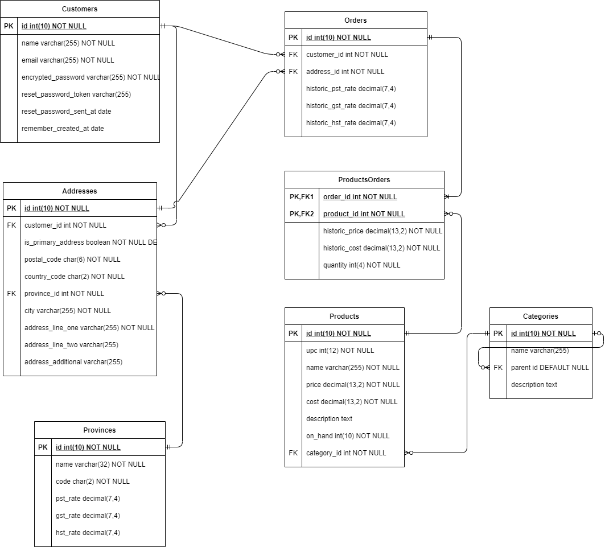

# Site Description
The name of the fictional business that the site is being designed for it The Office Supply Store (TOSS). TOSS employs 10-25 individuals and is based out of Southern Manitoba. They have been in business for 15 years and have traditionally sold their products via a catalogue distributed to local businesses, who are their primary clientele. TOSS would like to reach a wider market segment and as such they want to expand their online presence so that other businesses in Manitoba and beyond can take advantage of their services.
TOSS sells various recycled, refurbished, or otherwise cheap office supplies. They have at points experimented with selling office furnishings as well, but that is not their primary source of revenue.

# Database Structure
The database will consist of 5 primary objects: Customers, Addresses, Provinces, Orders, and Products. An additional join table called ProductsOrders will be created to store historical pricing data as well as product quantities ordered.

## Customers
The customers table will contain the Customer’s full name, Username, Email address, and password (salted and hashed).
### Relationships
- One Customer can have zero to many Orders
- One Customer can have zero to many Addresses

## Addresses
The Addresses table will contain a reference to the Customer who’s address it is, a flag for if it is the primary address, a postal code, the country code, a reference to a Province, the city name, the street address, and an optional line 2 street address and optional additional details.
### Relationships
- One Address belongs to one Customer. An address cannot exist without a Customer.
- An Address can have zero to many orders.
- One Address belongs to one Province. An address cannot exist without a Province.

## Provinces
The Province will contain the name, two letter province code, and optionally the PST, GST, and HST percentages applicable.
### Relationships
- One Province can have zero to many addresses.

## Orders
The Orders table contains a reference to the Customer, a reference to the Address, the date, and historic information regarding the applicable PST, GST, and HST.
### Relationships
- One Order has one Customer. An Order cannot exist without a Customer.
- One Order has one Address. An Order cannot exist without an Address.
- Through ProductsOrders, one Order can have one to many Products.

## Products
The Products table contains information such as the UPC of the Product, the price, cost, description, and quantity on hand.
### Relationships
- Through ProductsOrders, one Product can have zero to many Orders.
- One Product belongs to one Category

## ProductsOrders
The ProductsOrders table reifies the many to many relationships between Orders and Products. It contains historical cost and price of the product, as well as how many have been ordered.
### Relationships
- One ProductOrder belongs to one Product. A ProductOrder cannot exist without a Product.
- One ProductOrder belongs to one Order. A ProductOrder cannot exist without an Order.

## Categories
Categories table containing categories for the various products.
### Relationships
- One Category may have zero to many Products
- One Category may have zero to many Child Categories
- One Category may have zero to one Parent Category

# Entity Relationship Diagram

